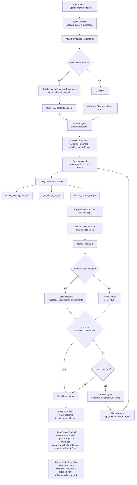

# Generate Design Flow (llm-service)

## Architecture Type
- **Current setup is a true multi-agent loop inside `AgentService` orchestration**.
- Logical agents and responsibilities:
  - **PlannerAgent**: builds architecture blueprint (actors, FR/NFR, entities, APIs, async workflows).
  - **DesignerAgent**: LangChain tool-calling agent that creates/iterates visual design.
  - **ValidatorAgent**: scores generated design against requirements.
  - **RefinerAgent**: emits directives and updates blueprint for next retry.
- Retry behavior is **threshold-driven** (`validationThreshold`) with bounded retries (`maxRefinementCycles`).

## End-to-End Flow

## Validation Behavior Today
- Validation is **iterative with retry-until-threshold logic**.
- The loop stops when one of these is true:
  - score meets/exceeds threshold,
  - retries exhausted,
  - validation loop disabled.
- Best-scoring attempt is selected and persisted with ADR metadata.

## What Makes It “Agentic” Right Now
- Planner/Designer/Validator/Refiner are explicit logical agents with distinct prompts and responsibilities.
- DesignerAgent uses external tools for design creation; other agents are reasoning agents over structured JSON.
- This is a **multi-agent looped orchestration architecture** (coordinated in one service process).
